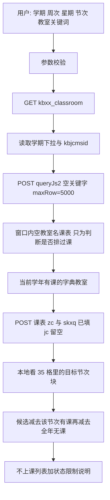

# 查无课教室

Feature Name: empty-classroom
Updated: 2026-10-08

## Description

已登录强智教务的用户按学期、周次、星期和节次范围查询「不上课」的教室。实现只使用学生端接口，不使用教师端借用矩阵。

2026-10-08 的接口文档补齐了学生端实测，本方案按新事实改写，废弃上一版的三处假设：

- `skjs` 是教室名，不是授课教师。`skjs=格物楼B101` 会把课表滤成这一行。`skjsid` 服务端不认，不能用来过滤。
- 教室名单来自 `POST /jsxsd/kbcx/queryJs2`。`skjs` 留空、`maxRow=5000` 返回 2452 条，展开后 2745 间。不必先抓全校课表再反推名单。
- `zc1`/`zc2` 与 `skxq1`/`skxq2` 会按范围去掉没有对应课程的教室行，但网格仍是 35 格。`jc1`/`jc2` 任意非空值都会把网格改坏，而且不同取值可以逐字节相同，节次必须留空，改在本地判断。

学生端单元格只有课程文本，没有借用、锁定、考试等状态位。结果语义仍是「该时段不上课」，不是「空闲可借用」。同一学期两边都可见的教室里，借用格在学生端显示为空白的有 1654 格，锁定格有 5 格。

文档第 11 节仍留有「时间参数未逐一验证」的旧句。以第 7.6 节的实测表为准。

已发布的教室总表只作规模参照，不作为运行时数据源。总表会过期，而且 skill 运行时不应依赖 ai-kit 仓库里的快照。

本文件只定义方案。不改 `easy-qfnu-kjs`，也不在本阶段写 CLI 或 Skill 使用说明。

## Architecture



调用顺序：校验参数 → 读父页 → 刷新字典 → 补齐多学期空教室名课表 → 发一次带周次和星期的课表 → 本地判断节次。

`jc1` 与 `jc2` 始终传空。不把节次交给服务端。周次和星期可以交给服务端，因为实测会减少行数，且 35 格形状不变。返回行消失表示该教室在该周次和星期没有课程，不能表示某个节次没有课程。节次仍要看返回行里的 `kbcontent`。

精确教室名才把 `skjs` 设为字典里的 `jsmc`。楼名或部分房号不传给课表接口，因为文档只验证了完整教室名。部分关键词先在字典 `jsmc` 上做包含匹配，课表仍用空 `skjs` 取该周次和星期的有课行，再在本地求交。

会话较脆，请求串行，并复用同一次登录拿到的 Cookie。基础地址使用 `http://zhjw.qfnu.edu.cn`。POST 的 `Content-Type` 为 `application/x-www-form-urlencoded`，`Referer` 为父页。`User-Agent` 使用真实桌面版 Chrome 标识。每次 HTML 响应先看标题，不单独信任 HTTP 200。

## Components and Interfaces

### 父页读取

```text
GET /jsxsd/kbcx/kbxx_classroom
Referer: http://zhjw.qfnu.edu.cn/jsxsd/framework/xsMain.jsp
```

成功标题是「全校性教室课表」。从该页读取：

- 学期下拉的全部 `value`，以及当前 `selected` 项。页面没有选中项时，拒绝查询。
- 当前选中的 `kbjcmsid`。没有该值时，拒绝查询。页面目前只有一个默认节次模式，仍以页面值为准，不把文档样本里的 ID 写死。

遍历窗口取下拉中不晚于当前选中学期的最近 13 项。比较规则：先比学年起始年，再比末位 `1/2/3`。格式不是 `YYYY-YYYY-N` 的选项跳过，并写入警告。

### 教室字典

```text
POST /jsxsd/kbcx/queryJs2
Referer: http://zhjw.qfnu.edu.cn/jsxsd/kbcx/kbxx_classroom

skjs=&maxRow=5000
```

成功响应是 JSON：`{"result": true, "list": [{"jsid": "...", "jsmc": "..."}]}`。

- `jsid` 与教师端 `jsbh` 同源。课表 HTML 里没有这个 ID，所以 ID 只来自字典，行与字典靠规范化后的中文名关联。
- `maxRow=5000` 的实测全量是 2452 条。若 `list` 长度等于请求的 `maxRow`，视为被截断，停止使用，不把残缺名单当成全集。
- 字典缓存超过 7 日则刷新。缓存文件不保存 Cookie。
- 不发送 `skjsid` 作为课表过滤条件。页面 JS 读的是 `jx0601id`，接口返回的是 `jsid`，而且服务端不认 `skjsid`。

### 空教室名课表搜索

用于判断某学期有哪些教室排过课，不用于代替字典。

```text
POST /jsxsd/kbcx/kbxx_classroom_ifr
Content-Type: application/x-www-form-urlencoded
Referer: http://zhjw.qfnu.edu.cn/jsxsd/kbcx/kbxx_classroom

xnxqh=<学期>&kbjcmsid=<父页当前值>&skyx=&xqid=&jzwid=&skjsid=&skjs=&zc1=&zc2=&skxq1=&skxq2=&jc1=&jc2=
```

路径必须是 `/jsxsd/kbcx/kbxx_classroom_ifr`。写成 `/jsxsd/kbxx/kbxx_classroom_ifr` 会返回非法访问。

校区不单独作为查询参数。`xqid` 留空。用户若只想看一栋楼，用教室关键词匹配字典里的楼名。

目标学期这份缓存超过 6 小时则刷新。其余学期超过 7 日则刷新。已结束学期的排课仍可能被教务补改，所以过期后仍刷新。

### 本次查询的课表

```text
POST /jsxsd/kbcx/kbxx_classroom_ifr
Referer: http://zhjw.qfnu.edu.cn/jsxsd/kbcx/kbxx_classroom

xnxqh=<学期>&kbjcmsid=<父页当前值>&skyx=&xqid=&jzwid=&skjsid=
&skjs=<精确教室名或空>&zc1=<周次>&zc2=<周次>&skxq1=<星期>&skxq2=<星期>&jc1=&jc2=
```

- 周次、星期使用用户给出的同一个值作为起止。页面范围是周次 1 到 30、星期 1 到 7。
- `jc1` 与 `jc2` 必须为空。数值、补零和块名都已实测为坏响应：数值把网格收成每天 1 列且表头恒为 `101112`；块名变成 `colspan="0"` 的空网格；补零会报错或超时。不同节次取值还可以逐字节相同，不能从行数推断节次过滤生效。
- 周次或星期过滤后，无对应课程的教室整行消失，留下的行仍是 35 格。解析器必须仍按 35 格读取。若列数不是 35，停止反推。
- 关键词与某条未展开的 `jsmc` 完全相同时，`skjs` 使用该 `jsmc`。否则 `skjs` 留空。不把展开后的单体名发给未经验证的精确过滤。

### 课表解析

成功响应含 `table#kbtable`。表头第二行第 1 格是「教室\节次」，随后 35 个节次块名。数据行第 1 格是教室展示名，其余格是课程或空格。

判空以「单元格是否含 `<div class="kbcontent...">`」为准。空单元格原文是 `<nobr> &nbsp; </nobr>`，课程正文里也可能出现 `&nbsp;`。先把 HTML 实体解开，再找 `kbcontent`。同一格的多个课程块 class 都是 `kbcontent1`，按 div 顺序收集。

35 列按下表映射。列序或块名与下表不一致时，整份响应不可用。

| 星期 | 列序 | 块名 | 小节 | 时间 |
| --- | --- | --- | --- | --- |
| 1 至 7 | 每天 5 列 | `0102` | 1、2 | 08:00–09:30 |
|  |  | `030405` | 3、4、5 | 09:50–12:00 |
|  |  | `0607` | 6、7 | 14:00–15:25 |
|  |  | `0809` | 8、9 | 15:45–17:10 |
|  |  | `101112` | 10、11、12 | 19:00–21:10 |

学生端表头不带开始和结束时间，时间只用这张固定映射。块内小节没有独立占用位；查询节次与块内任一小节相同，整块都进入查询范围。因此查第 3 节时，`030405` 上有课的教室不算不上课。

服务端已经按周次过滤时，返回的课程块仍解析周次。解析出的周次与查询周次不相交时，不把该块算作占用。一个周次都解析不出来时，该块在 1 到 30 周都视为有课。

### 合称展开

字典 `jsmc` 和课表行首名称使用同一套展开规则。先去掉首尾空白，再按 `、`、`.` 和空白切开。`-` 只在两侧都能取出房号时切开，且不补中间房号。`数学楼401、403` 不包含 `数学楼402`。

房号是名称末尾匹配 `[A-Za-z]*\d+[A-Za-z]?` 的部分，其余是楼栋前缀。后一项若只有数字和可选尾缀，继承前一项房号的字母头，例如 `F101-102` 得到 `F101`、`F102`。后一项若已以字母加数字开头，只继承楼栋前缀。`F128-F129` 得到 `F128`、`F129`。

`JC1003a` 与 `JC1003` 保持为两间教室。关键词 `JC1003` 可以同时命中二者。结果里仍各算一间。

展开失败的原始名称进入 `warnings`，不进入不上课结果。合称行上的课程块复制到该行展开出的每一间单体教室。合称字典记录的 `jsid` 记在 `source_jsid` 上，不拆成两个 ID。

### 周次解析

从每个课程块文本中收集周次表达式：

- `A-B周` 表示闭区间 A 到 B。
- `A周` 表示单周 A。
- 逗号或中文顿号连接多个区间，取并集。
- `单` 或 `单周` 只保留奇数周；`双` 或 `双周` 只保留偶数周。限定词作用在同一课程块已经解析出的区间上；没有区间时，作用于 1 到 30。
- 一块里有多个表达式时取并集。

### 缓存

缓存目录为 `~/.local/state/easy-qfnu-skill/classroom-schedule/`。可用环境变量 `QFNU_CLASSROOM_CACHE_PATH` 改到别的目录。

- `dictionary.json`：教室字典。
- `<学期>.json`：该学期空教室名课表的解析结果。

刷新按请求串行。同一进程里同一资源只允许一个刷新；后来的查询等待这次结果。不并行打 13 个约 3.35 MB 的响应。

传输被掐断时丢弃正文，最多再请求 2 次。课表完整的条件是：标题不是登录页，能取出闭合的 `table#kbtable`，且 35 个节次块名符合上表。不把残缺 HTML 写入缓存。

非目标学期刷新失败时，未过期旧缓存可以继续用于全年无课判断，结果里的 `cache.stale_semesters` 列出这些学期。没有旧缓存则停止反推。目标学期刷新失败时停止反推。6 小时内的目标学期缓存才可以直接使用。

字典刷新失败时，7 日内的旧字典可以继续使用，并写入 `cache.stale_dictionary`。没有可用字典则停止反推。

缓存不保存 Cookie、`encoded`、账号或密码。

### 反推

记查询为学期 S、周次 W、星期 D、节次闭区间 `[Jc1, Jc2]`、关键词 K。

1. 字典集：`queryJs2` 展开后的单体教室。
2. 候选集：字典集中，当前学年每个完整学期里至少出现过一个课程块的单体教室。S 本身若完整，也参加这个并集。本学期整学期没有排课、但当前学年另一个完整学期有课的教室留在候选集里。
3. 指定教室集：K 为空时等于候选集。K 与某条未展开 `jsmc` 完全相同，或 K 是展示名的包含匹配时，保留命中的候选教室。规范化只做首尾空白去除、连续空白压缩，以及全角数字转半角。不做 a 至 d 尾缀合并。
4. 占用集：本次带 `zc1=zc2=W`、`skxq1=skxq2=D`、`jc` 为空的课表中，星期 D 上、块小节与 `[Jc1, Jc2]` 相交、且周次集合包含 W 的单体教室。该响应里没有出现的教室，不进入占用集。
5. 全年无课集：字典集中不属于候选集的单体教室。
6. 不上课集：指定教室集减去占用集。

S 的空教室名课表不是完整学期时停止反推。完整阈值：秋季、春季展开后至少 200 间；夏季至少 50 间。低于阈值的学期不证明「有过课」，也不证明「全年没课」。当前学年若没有一个完整的秋季或春季课表，停止反推。

`excluded_year_round_idle_count` 是关键词过滤前、属于全年无课集的教室数。它不随 K 改变。

结果按展示名的字典序排列。同一展示名多行出现时合并课程块，占用取并集。课表没有稳定主键，同名不同房间无法拆开，结果保留展示名，并在能对应到唯一字典记录时带上 `jsid`。同名多条字典记录时 `jsid` 为空，并在 `warnings` 记录「同名行已合并」。

## Data Models

教室字典缓存：

```json
{
  "fetched_at": "2026-10-08T09:30:00+08:00",
  "max_row": 5000,
  "record_count": 2452,
  "room_count": 2745,
  "records": [
    {
      "jsid": "DB3511C3DF574E3A8F75F7611C5EAE3B",
      "jsmc": "格物楼B101",
      "rooms": ["格物楼B101"]
    }
  ]
}
```

学期课表缓存：

```json
{
  "semester": "2026-2027-1",
  "kbjcmsid": "<父页读取值>",
  "fetched_at": "2026-10-08T09:30:00+08:00",
  "complete": true,
  "source_row_count": 635,
  "room_count": 730,
  "block_names": ["0102", "030405", "0607", "0809", "101112"],
  "rooms": [
    {
      "name": "数学楼401",
      "source_names": ["数学楼401、403"],
      "blocks": [
        {
          "weekday": 1,
          "block": "0102",
          "periods": [1, 2],
          "weeks": [6, 7],
          "weeks_unparsed": false,
          "course_count": 1
        }
      ]
    }
  ]
}
```

`weeks_unparsed` 为 true 时，`weeks` 写 1 到 30。

查询成功结果：

```json
{
  "ok": true,
  "semester": "2026-2027-1",
  "week": 6,
  "weekday": 1,
  "weekday_name": "星期一",
  "period_start": 1,
  "period_end": 2,
  "blocks": ["0102"],
  "keyword": "数学楼",
  "skjs": "",
  "limitation": "这些教室只是该时段不上课，无法获知是否被借用或锁定。",
  "excluded_year_round_idle_count": 12,
  "count": 1,
  "rooms": [
    {
      "name": "数学楼405",
      "jsid": "",
      "status": "no_class",
      "status_text": "不上课",
      "evidence_semesters": ["2026-2027-1"],
      "source_names": ["数学楼405"]
    }
  ],
  "cache": {
    "window": ["2022-2023-2"],
    "refreshed_semesters": ["2026-2027-1"],
    "stale_semesters": [],
    "stale_dictionary": false
  },
  "warnings": []
}
```

精确教室名查询时 `skjs` 等于该字典名。楼名关键词查询时 `skjs` 为空。`limitation` 在 `ok` 为 true 时必须存在，包括 `count` 为 0。面向用户的转述使用 `status_text` 和 `limitation`，不把 `status` 译成「空闲」或「可借用」。

失败结果沿用现有 CLI 的 `ok: false`、`error` 与 `hint`。失败时不返回 `rooms`。

## Correctness Properties

- 不上课集是指定教室集的子集，也是候选集的子集。
- 占用集中的教室不出现在不上课集。
- 全年无课集与候选集不相交。
- 查询范围至少覆盖一个节次块；与该块小节相交的有课记录足以把教室排除出不上课集。
- 发往课表接口的 `jc1` 与 `jc2` 为空。
- 只有与未展开 `jsmc` 完全相同的关键词才会写入 `skjs`。
- 合称行的课程块对展开出的每间单体教室生效。
- 关键词过滤不创造字典里不存在的教室。
- 缓存往返后，`jsid`、教室名、节次块、周次集合和 `weeks_unparsed` 保持不变。
- 登录页、非法访问页、缺少 `kbtable` 的页面、节次块名变化的页面、非 35 格网格，都不产生不上课教室。
- 结果中的每间教室都带「不上课」，成功结果都带同一句状态限制说明。

## Error Handling

| 情况 | 处理 |
| --- | --- |
| 未登录或标题为登录页 | 停止，要求重新登录。不把登录页写入缓存。 |
| 非法访问，或父页标题不是「全校性教室课表」 | 停止，说明页面未被识别。通常是路径误用 `kbxx`。 |
| 父页没有学期选中项或没有 `kbjcmsid` | 停止，说明节次模式不可用。 |
| 周次不在 1 到 30，星期不在 1 到 7，节次不在 1 到 12，或起始节次大于结束节次 | 停止，指出无效参数。不发上游请求。 |
| 目标学期不在父页下拉中 | 停止，说明无法使用该学期。 |
| `queryJs2` 的 `result` 不是 true，或 `list` 长度等于 `maxRow` | 停止使用该次字典。有 7 日内旧字典则继续并标记；否则停止反推。 |
| 分块传输中断 | 丢弃正文，最多再请求 2 次。仍失败则按该资源刷新失败处理。 |
| 响应没有闭合 `kbtable`，或 35 个块名不符合约定 | 该响应不可用，不写入缓存。 |
| 带周次和星期的响应不是 35 格 | 停止反推。不把缺列解释为该节次无课。 |
| 目标学期展开后的教室数低于完整阈值 | 停止反推。不把缺失行解释为不上课。 |
| 当前学年没有完整秋季课表，也没有完整春季课表 | 停止反推，说明全年过滤缺少可用课表。 |
| 非目标学期刷新失败，但有未过期缓存 | 继续，并列入 `stale_semesters`。 |
| 非目标学期没有可用缓存 | 停止，说明全年无课名单不完整。 |
| 会话在窗口中途失效 | 停止后续 POST，保留已经校验通过的缓存，要求重新登录。 |
| 展示名无法展开 | 该名称不进入结果，原始名称写入 `warnings`。 |
| 课程块没有可解析周次 | 该块视为 1 到 30 周都有课。 |
| 关键词没有命中字典 | `ok` 为 true，`count` 为 0，仍返回状态限制说明。 |
| 未来学期或空学期 | 不进入遍历窗口。窗口以父页当前选中学期为上界。 |

不完整夏季学期被忽略，不把它的十几间教室当成该学年唯一有课名单，也不用它把其他教室判成全年无课。

## Test Strategy

单元测试使用固定 HTML 与 JSON 片段，不访问教务站，不读取真实 Cookie。

- 父页解析：选中学期、`kbjcmsid`、登录页、缺字段。
- 字典解析：`jsid` 与 `jsmc`；`list` 长度等于 `maxRow` 时拒绝；合称展开后保留同一个 `source_jsid`。
- 课表解析：`&nbsp;` 空格不算有课；课程正文中的 `&nbsp;` 仍算有课；一格多个 `kbcontent1` 都保留。
- 请求构造：精确 `jsmc` 写入 `skjs`；楼名关键词不写入 `skjs`；`jc1` 与 `jc2` 始终为空；`skjsid` 为空。
- 网格守卫：7 列或 `colspan="0"` 的响应不产生不上课教室。
- 合称：`数学楼401、403`、`化学楼127.129`、`F101-102`、`F128-F129`、`实验中心B区B104、B106`。连字符不补中间房号。
- 周次：区间、单周、双周、并列区间、无法解析时占满 1 到 30。
- 反推：候选减去占用；服务端未返回的教室在目标节次上视为不上课；全年无课被排除；本学年其他学期有课但目标学期无行的教室保留为不上课；关键词只缩小不新增。
- 节次块部分重叠：查第 3 节时，`030405` 有课的教室被排除。
- 完整阈值：秋季 199 间停止反推；夏季 49 间不参与全年证据；夏季 50 间且有课程块的教室进入候选集。
- 缓存往返：写入后再读，`jsid`、教室、节次块和周次一致；文件中没有 Cookie 字段。
- 失败页：登录页、非法访问、缺表、块名变化，都不产生 `rooms`。

实现阶段再把这些用例落到 `python/tests/`。本阶段不新增测试代码。

## Cross-repo Check

| 仓库 | 结论 |
| --- | --- |
| `easy-qfnu-skill` | 本方案写在此仓 `specs/empty-classroom/`。公开 `SKILL.md` 与 `README.md` 等实现完成后再改。 |
| `easy-qfnu-cli` | 与 Skill 同仓。实现阶段才接入学生端只读查询。 |
| `easy-qfnu-hub` | 不改。本功能不新增统计事件，也不上传课表。 |
| `easy-qfnu-kjs` | 不改。该仓继续用教师端快照表达借用和锁定。本功能的结果不得写成 kjs 的空闲状态。 |
| `easy-qfnu-precourse` | 不改。预选课缓存不是教室占用。 |
| `easy-qfnu-recommendation` | 不改。 |
| `easy-qfnu-ranking` | 不改。 |
| `easy-qfnu-freshman-exam` | 不改。 |
| `easy-qfnu-guide` | 不改。 |

已归档的 `easy-qfnu-course-recommendations` 不改。

## References

[^1]: (Website) - [教室状态与空教室查询 API](https://github.com/w1ndys/ai-kit/blob/main/docs/qfnu-classroom-status-api.md)，学生端字典见第 7.4 节，时间筛选见第 7.6 节，假空闲见第 11.1 节。
[^2]: (Website) - [教室总表](https://github.com/w1ndys/ai-kit/blob/main/docs/qfnu-classroom-roster.md)，只作 2745 间规模参照，不作为运行时数据源。
[^3]: (Filename#L172) - [教务侧栏中的教室课表入口](references/jwxt.md)
[^4]: (Filename#L53) - [个人课表已有的 kbcontent 判空方式，教室课表应改用课程块而不是纯文本](python/qfnu/jwxt_schedule.py)
