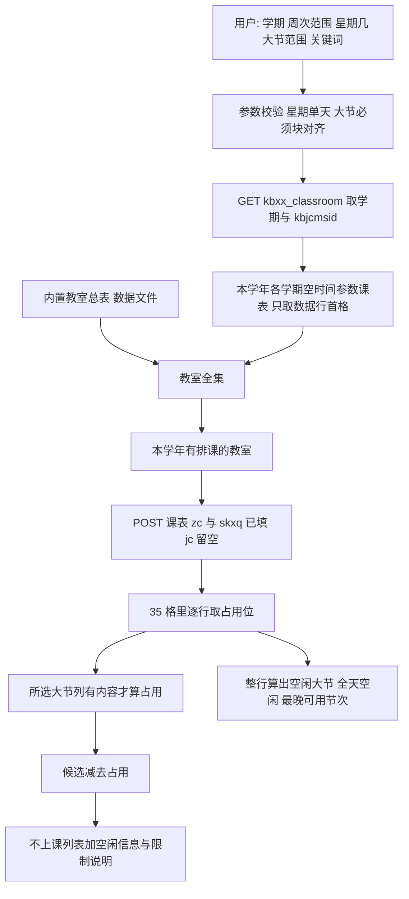

# 查无课教室

Feature Name: empty-classroom
Updated: 2026-10-08

## Description

已登录强智教务的用户按学期、周次范围、某一个星期几和**大节范围**查询「不上课」的教室，并附带这间教室这一天的空闲情况。实现只使用学生端接口，不使用教师端借用矩阵。

判定用两类信息：**数据行首格的教室名**，以及**该行每一格有没有内容**。课程名、教师、班级、周次文字一概不读。

- 教室全集来自两处：随仓库分发的**内置教室总表**（学生端教室字典 `POST /jsxsd/kbcx/queryJs2` 的一次快照，`skjs` 留空、`maxRow=5000`，2452 条展开后 2650 间），以及**本学年各学期课表首格展开出的教室名**。两者取并集，原因见「内置教室总表」。
- 周次与星期交给 `zc1`/`zc2`、`skxq1`/`skxq2`。它们**不只筛教室行，还会把格内容一起筛掉**：`skxq1=1&skxq2=1` 的实测响应里只有星期一那一列有内容（1207 格），周二到周日整列为空；`zc1=1&zc2=1` 把 635 行降到 538 行、有课格从 6142 降到 4571，但 7 天都还在。**星期顶死一天**，所以返回的 35 格里只有那一天有内容。
- 由此得到空闲信息的口径：`free_blocks`、`occupied_blocks` 与三个时段字段都是**单天**的，只统计查询的那一天，不含别的星期。
- 节次参数 `jc1`/`jc2` **留空**，取当天全部 5 个大节，网格是 7 天 × 5 块 = 35 格。这样才能算出「全天空闲」和「最晚可用节次」。
- 用户选的大节只作本地判定条件：该教室在所选大节上有内容才算占用。

为什么不发 `jc1`/`jc2`：它们只在「用户想收窄到某个大节」时才有用，而本功能要的是当天全景；而且服务端的映射规则有坑——`jc1` 向上吸附到最近的块起点、`jc2` 吸附到所在块，`jc1` 若不用块起点会**静默丢掉第一个块**（查 1–5 节传 `02&05` 只会返回 `030405`）。规则见 ai-kit 文档第 7.6.3 节。

用户能选的节次必须按大节对齐：一格就是一个大节（`0102`/`030405`/`0607`/`0809`/`101112`），块内小节共用一格。所以大节范围的起点只能取块的第一小节（`01`/`03`/`06`/`08`/`10`），终点取 1 到 12 的任意小节、其所在大节整块纳入。查第 4 节时范围记作 `3–5`；`4–4`、`2–5` 这类起点落在块中间的写法直接拒绝，不猜用户想查哪一块。

学生端单元格只有课程文本，没有借用、锁定、考试等状态位。结果语义是「该时段不上课」，不是「空闲可借用」。同一学期两边都可见的教室里，借用格在学生端显示为空白的有 1654 格，锁定格有 5 格。

`skjs` 是教室名，不是授课教师；`skjsid` 服务端不认。内置总表随仓库分发，运行时不再请求教室字典接口。

本文件只定义方案。不改 `easy-qfnu-kjs`，也不在本阶段写 CLI 或 Skill 使用说明。

## Architecture



调用顺序：校验参数 → 读父页 → 载入内置总表 → 补齐本学年学期缓存 → 发一次带周次和星期的课表（`jc` 留空）→ 逐行判占用并算空闲信息 → 求差。载入内置总表只读本地数据文件，不发请求。

会话较脆，请求串行，并复用同一次登录拿到的 Cookie。基础地址使用 `http://zhjw.qfnu.edu.cn`。POST 的 `Content-Type` 为 `application/x-www-form-urlencoded`，`Referer` 为父页。`User-Agent` 使用真实桌面版 Chrome 标识。每次 HTML 响应先看标题，不单独信任 HTTP 200。

判参数问题前先确认拿到的是课表页（含 `id="kbtable"`）：响应体若是「您的账号在其它地方登录」这类会话互踢提示，与参数无关。

## Components and Interfaces

### 父页读取

```text
GET /jsxsd/kbcx/kbxx_classroom
Referer: http://zhjw.qfnu.edu.cn/jsxsd/framework/xsMain.jsp
```

成功标题是「全校性教室课表」。从该页读取：

- 学期下拉的全部 `value`，以及当前 `selected` 项。页面没有选中项时，拒绝查询。
- 当前选中的 `kbjcmsid`。没有该值时，拒绝查询。页面目前只有一个默认节次模式，仍以页面值为准，不把文档样本里的 ID 写死。

本学年学期取下拉里目标学年的秋季、春季两项，以及响应完整的夏季项。学期值末位 `1` 为秋、`2` 为春、`3` 为夏；学年由前两段判定。格式不符的下拉项跳过并记入警告。

### 教室全集：内置快照 + 本地累计

教室全集有三个来源，**结果集的正确性只由候选集与占用集决定**，所以任何一个来源缺失或过期都不影响结果对不对：

1. **内置快照**（随仓库分发）：提供 `jsid`，以及「快照里有、本学年课表没出现」这类教室的计数基线。
2. **本地累计**：缓存目录里**所有学期**（不限本学年、不限是否过期）的 `<学期>.json` 教室名。
3. **本次响应**：本次查询课表首格展开出的教室名。

第 2 条是「不长期依赖作者维护」的关键：每成功解析一个学期的课表就把该学期的教室名写进它的缓存文件，之后新学年、新学期出现的教室会被自动累计进来，不需要作者为每个新学期发新版。

内置快照来自一个**只有教师账号能请求**的接口，学生账号请求它一律返回「非法访问」错误页：

```text
POST /jsxsd/kbcx/queryJs2
Referer: http://zhjw.qfnu.edu.cn/jsxsd/kbcx/kbxx_classroom

skjs=&maxRow=5000
```

该请求曾返回 `{"result": true, "list": [{"jsid": "...", "jsmc": "..."}]}`（`skjs` 留空、`maxRow=5000` 时实测 2452 条）。2026-10-08 实测起，用学生账号不论入参、方法、请求头、Referer 或前置访问顺序，该路径一律返回 730 字节的「非法访问」错误页；同模块的 `getJxlByAjax` 仍正常，父页 HTML 里也仍写着这个 `serviceUrl`。结论是**该端点只对教师账号开放**（当日成功抓到 2452 条的那次用的正是教师账号的 cookie），因此学生侧方案放弃运行时请求它。

因此把它的一次成功抓取结果作为**数据文件随仓库分发**，运行时只读这个文件（它是起点，不是长期依赖）：

- 文件结构：`{"source", "captured_at", "max_row", "count", "rooms": [[jsid, jsmc], ...]}`，一条记录一对，保持抓取原样（不展开）。
- 载入后按与下游一致的形状展开成 `jsid`、`jsmc`、`rooms`、`source_jsid`、`expanded`，供反推与关键词匹配复用。
- `jsid` 与教师端 `jsbh` 同源；课表 HTML 里没有这个 ID，所以 ID 只来自这份快照。
- 快照缺失、损坏或与当前学期不符时，全集退化为「本地累计 + 本次响应」，并在 `warnings` 说明 `jsid` 与全年无课计数不可用；此时结果集仍然正确。
- 刷新办法：只有拿得到教师账号时才能重新抓取并替换该文件，属于维护动作，不在运行路径上；即使一直不刷新，功能也不会因此失效。

**为什么取并集**：快照是固定的，学校新加的教室会先出现在课表里而不在快照里。只用快照当全集，这些新教室既进不了候选集也进不了结果，等于静默漏报；把本地累计与本次响应里观察到的教室并进来就不会漏。

不发送 `skjsid` 作为课表过滤条件：页面 JS 读的是 `jx0601id`，接口返回的是 `jsid`，而且服务端不认 `skjsid`。

### 学期课表（只取数据行首格）

用于判断某学期有哪些教室有排课。时间参数全部留空，取该学期全部 5 个大节。

```text
POST /jsxsd/kbcx/kbxx_classroom_ifr
Referer: http://zhjw.qfnu.edu.cn/jsxsd/kbcx/kbxx_classroom

xnxqh=<学期>&kbjcmsid=<父页当前值>&skyx=&xqid=&jzwid=&skjsid=&skjs=
&zc1=&zc2=&skxq1=&skxq2=&jc1=&jc2=
```

路径必须是 `/jsxsd/kbcx/kbxx_classroom_ifr`。写成 `/jsxsd/kbxx/kbxx_classroom_ifr` 会返回非法访问。`xqid` 留空，三个校区一起返回。

### 大节对齐

用户输入按小节给，起点必须落在块的开头：

| 用户输入 | 是否接受 | 对应块 |
| --- | --- | --- |
| `1–2` | 接受 | `0102` |
| `3–5` | 接受 | `030405` |
| `4–4` | **拒绝** | 4 落在 `030405` 中间，改填 `3–5` |
| `2–5` | **拒绝** | 2 属 `0102`、5 属 `030405`，改填 `1–5` |
| `6–8` | 接受 | `0607` + `0809` |
| `1–7` | 接受 | `0102` + `030405` + `0607` |
| `3–8` | 接受 | `030405` + `0607` + `0809` |
| `1–12` | 接受 | 全部 5 块 |
| `3–4` | 接受 | `030405`（4 落在 `030405` 内，与 `3–5` 同一块） |
| `1–11` | 接受 | 全部 5 块（11 落在 `101112` 内） |

校验规则：起始小节必须属于 `{1, 3, 6, 8, 10}`，结束小节取 1 到 12 的任意值，且起始不得大于结束。不满足就拒绝，并在提示里给出允许的取值。

范围**可以跨多个大节**，没有「一次只能查一块」的限制：`1–7` 覆盖 `0102` + `030405` + `0607`，`3–8` 覆盖 `030405` + `0607` + `0809`，`1–12` 覆盖全部 5 块。限制只落在起点上：起点必须是某块的**第一小节**，终点写它所在块内哪一小节都按整块纳入，所以范围永远由整块拼成、没有「半个块」的歧义（`2–5` 被拒是因为起点 2 落在 `0102` 的末尾、`0102` 只有一半进范围；`3–4` 与 `3–5` 覆盖的都是 `030405`）。

覆盖块就是与 `[P1, P2]` 相交的那几块，按表头顺序排列。

### 时段划分与空闲开关

时段按整天口径固定，与用户选的大节范围无关：

| 时段 | 覆盖大节 | 小节 | 时间 |
| --- | --- | --- | --- |
| 上午 | `0102` + `030405` | 1–5 | 08:00–12:00 |
| 下午 | `0607` + `0809` | 6–9 | 14:00–17:10 |
| 晚上 | `101112` | 10–12 | 19:00–21:10 |

过滤开关：`--free-morning`、`--free-afternoon`、`--free-evening`、`--free-all-day`。每个开关只保留在该时段全部大节都没有课的教室；同时给多个开关时取交集（例如「上午空闲 + 晚上空闲」= 上午和晚上都没课）；`--free-all-day` 等价于三个时段都空闲。过滤只筛结果，不改写任何字段。

**口径**：`free_*`、`occupied_blocks` 与 `last_free_period` 都以**查询的那一天**为界——查星期三就是「星期三整天」。请求里 `skxq1` 与 `skxq2` 恒为同一天，所以这些字段永远是单天口径，不存在跨天合并。行不出现表示该教室在这周这天没有排课，此时 5 个块都算空闲、`free_all_day` 为 true。服务端会把其他星期的格清空，所以只能用所查那天的那 5 个格，不能拿别的列推断。

之所以能算出这些字段，是因为本次查询**不按节次裁剪**：`jc1`/`jc2` 留空，响应里每行是 7 天 × 5 块共 35 格，所查那天的 5 格就是该教室整天 5 个大节的占用情况。若改成发 `jc` 裁剪到用户选的大节，响应里就只剩那几列，`free_blocks` 与三个时段字段都无从算起。

### 本次查询的课表

```text
POST /jsxsd/kbcx/kbxx_classroom_ifr
Referer: http://zhjw.qfnu.edu.cn/jsxsd/kbcx/kbxx_classroom

xnxqh=<学期>&kbjcmsid=<父页当前值>&skyx=&xqid=&jzwid=&skjsid=
&skjs=<精确教室名或空>&zc1=<起始周次>&zc2=<结束周次>
&skxq1=<星期>&skxq2=<星期>&jc1=&jc2=
```

- 星期**顶死一天**：`skxq1` 与 `skxq2` 传同一个星期几（`1`–`7`）。用范围会把多天的格混在一次响应里，与「只看某一天的某个时段」这个场景不符，所以校验层只接受单天。
- `jc1` 与 `jc2` 留空，网格保持 35 格：这是能算出整天占用情况的前提（发 `jc` 会把网格裁到所选大节）。
- 响应中的教室行由周次和这一天决定：某教室在这周这天有课就会出现，那天没课就不出现。
- 关键词与某条未展开的 `jsmc` 完全相同时，`skjs` 使用该 `jsmc`。否则 `skjs` 留空，关键词只在本地按展示名过滤。部分关键词直接发给 `skjs` 的行为未验证，不做假设。

### 响应解析

成功响应含 `table#kbtable`。解析取三样东西：

1. 定位 `table#kbtable`，校验表头：第 1 格是「教室\节次」，其后是 7 天 × 5 块共 35 个节次块名，顺序为 `0102`/`030405`/`0607`/`0809`/`101112` 重复 7 次。
2. 逐行取首格文本作为教室展示名，套用合称展开。首格取不出名字的行跳过并记入 `warnings`。
3. 把该行 35 格压成「星期 × 块」的占用位：含 `<div class="kbcontent...">` 结构即为有课。

**单元格文字一律不读**：课程名、教师、班级、周次都不参与判定。判据是「含 `kbcontent` 结构」，不是「文本非空」——空格的原文是 `<nobr> &nbsp; </nobr>`，而真实课程正文里也可能出现 `&nbsp;`，只看文本会把空格当有课。

数据格数不是 35（7 天 × 5 块）时，整份响应不可用：这说明课表结构变了，不能拿缺失的列去推断空闲。

### 合称展开

总表 `jsmc` 和课表数据行首格使用同一套展开规则。先去掉首尾空白，再按 `、`、`.` 和空白切开。`-` 只在两侧都能取出房号时切开，且不补中间房号。`数学楼401、403` 不包含 `数学楼402`。

房号是名称末尾匹配 `[A-Za-z]*\d+[A-Za-z]?` 的部分，其余是楼栋前缀。后一项若只有数字和可选尾缀，继承前一项房号的字母头，例如 `F101-102` 得到 `F101`、`F102`。后一项若已以字母加数字开头，只继承楼栋前缀。`F128-F129` 得到 `F128`、`F129`。

`JC1003a` 与 `JC1003` 保持为两间教室。关键词 `JC1003` 可以同时命中二者。结果里仍各算一间。

展开失败的原始名称进入 `warnings`，不进入不上课结果。合称行的占用位与空闲信息对展开出的每一间单体教室相同。合称总表记录的 `jsid` 记在 `source_jsid` 上，不拆成两个 ID。

### 缓存

缓存目录为 `~/.local/state/easy-qfnu-skill/classroom-schedule/`。可用环境变量 `QFNU_CLASSROOM_CACHE_PATH` 改到别的目录。

- `<学期>.json`：该学期有排课的教室名列表，只含首格结果。**这些文件是长期资产**：过期只表示「该重新拉取」，文件本身不删除，并且所有学期的文件夹在一起构成全集里的「本地累计」部分。
- 内置快照**不在这份缓存里**：它是随仓库分发的数据文件，位置见「教室全集」。

本学年学期缓存超过 7 日则刷新。缓存只保存教室名，不保存任何单元格内容。

刷新失败时重读一次缓存文件：这期间别的进程可能刚好刷新好这份缓存，读到未过期的就用它并记入 `stale_semesters`；过期缓存仍算不可用——否则会把残缺名单当成「这些教室不上课」的证据。

刷新按请求串行。同一进程里同一资源只允许一个刷新；后来的查询等待这次结果。不并行打多个学期的响应。

传输被掐断时丢弃正文，最多再请求 2 次。课表可用的条件是：标题不是登录页，能取出闭合的 `table#kbtable`，且至少有一行首格能取出教室名。不把残缺 HTML 写入缓存。

某个学期刷新失败时，未过期旧缓存可以继续用于全年无课判断，结果里的 `cache.stale_semesters` 列出这些学期；没有旧缓存则停止反推。

内置快照是本地文件，没有刷新这一步；它读不出来时按「教室全集」的退化口径处理，不用重试。

缓存不保存 Cookie、`encoded`、账号或密码。

### 反推

记查询为学期 S、周次闭区间 `[W1, W2]`、查询日 D（单个星期几）、大节闭区间 `[P1, P2]`、覆盖块 B、关键词 K。

1. 全集：三个来源的并集——内置快照展开后的单体教室、**缓存目录里所有学期（不限本学年）缓存的教室名**、本次响应首格展开出的教室名；`jsid` 只来自快照。
2. 候选集：全集里，在本学年某个完整学期数据行首格出现过的单体教室。S 本身若完整，也参加这个并集。
3. 指定教室集：K 为空时等于候选集；K 非空时保留规范化后展示名包含 K 的教室。规范化只做首尾空白去除、连续空白压缩、全角数字转半角，不做 a 至 d 尾缀合并。
4. 占用集：本次课表里首格给出的单体教室中，覆盖块 B 在该查询日 D 的列上至少有一个占用格的。
5. 空闲信息：对同一行，逐块看它在 D 的列上有没有占用格，得到该教室这一天的空闲大节；5 块全空闲即全天空闲；最晚可用节次取空闲大节里最后一块的末小节（全天空闲 = 12，无空闲大节 = 0）。
6. 全年无课集：全集里不属于候选集的单体教室。
7. 不上课集：指定教室集减去占用集，每条结果带上第 5 步的空闲信息。

**行出现不等于占用**：某教室在这周这天有课，但课可能不在用户要的大节上。所以必须按所选大节的列判断。反过来，行没出现说明它在这周这天没有排课，此时它既不在占用集里，空闲大节也是全部 5 块。

**整天没课的教室照样在结果里**，这是本方案最容易误解的一点：结果集不是从响应行来的，响应只用来做减法（`结果 = 指定教室集 − 占用集`）。候选集来自内置总表与本学年各学期缓存的首格，与本次响应无关，所以它能兜住那些「今天根本没课、因此压根不出现在响应里」的教室。

| 教室 | 在本次响应里 | 在候选集里 | 是否进结果 | 空闲标记 |
| --- | --- | --- | --- | --- |
| A：这天 1–2 节有课 | 有，`0102` 有占用格 | 有 | 查 1–5 节：不进；查 6–12 节：进 | `occupied_blocks = ["0102"]` |
| B：**这天整天没课** | **没有**（`zc`/`skxq` 把这类行整个去掉） | 有（本学年其他时候有课） | **进** | `free_all_day = true`，`free_blocks` 为全部 5 块，`last_free_period = 12` |
| C：整学年都没课 | 没有 | 没有 | 不进 | 归入全年无课集，被年度规则排除 |

大节范围越宽，覆盖块越多，占用集只会更大，不上课集只会更小。空闲信息与占用判定用的是同一行数据，所以结果自洽：一间教室若出现在「不上课」列表里，它在所选大节上必然没有占用格。

学期完整性阈值：秋季、春季的教室名数至少 200，夏季至少 50。低于阈值的学期不证明「有排课」，也不证明「全年没课」。S 不完整时停止反推；当前学年若没有一个完整的秋季或春季课表，也停止反推。

`excluded_year_round_idle_count` 是关键词过滤前、属于全年无课集的教室数，不随 K 改变。

结果按展示名排序。能对应到唯一总表记录时带 `jsid`；同名多条总表记录、或只在课表里出现的教室，`jsid` 为空，前者还在 `warnings` 记录「同名行已合并」。课表响应没有稳定主键，同名不同房间无法拆开。

## Data Models

内置总表数据文件（随仓库分发，不是缓存）：

```json
{
  "source": "/jsxsd/kbcx/queryJs2",
  "captured_at": "2026-10-08T15:14:00+08:00",
  "max_row": 5000,
  "count": 2452,
  "rooms": [
    ["DB3511C3DF574E3A8F75F7611C5EAE3B", "格物楼B101"]
  ]
}
```

学期缓存只存教室名：

```json
{
  "semester": "2026-2027-1",
  "kbjcmsid": "<父页读取值>",
  "fetched_at": "2026-10-08T09:30:00+08:00",
  "complete": true,
  "source_row_count": 635,
  "room_count": 730,
  "rooms": ["数学楼401", "数学楼403", "格物楼B101"]
}
```

查询成功结果：

```json
{
  "ok": true,
  "semester": "2026-2027-1",
  "week_start": 6,
  "week_end": 6,
  "weekday": 3,
  "weekday_name": "星期三",
  "period_start": 1,
  "period_end": 5,
  "blocks": ["0102", "030405"],
  "keyword": "数学楼",
  "skjs": "",
  "limitation": "这些教室只是该时段不上课，无法获知是否被借用或锁定。",
  "block_note": "节次按大节判断：块内小节共用一格，任一小节有排课即视为该大节有课。",
  "excluded_year_round_idle_count": 12,
  "count": 1,
  "rooms": [
    {
      "name": "数学楼405",
      "jsid": "",
      "status": "no_class",
      "status_text": "不上课",
      "free_all_day": false,
      "free_morning": false,
      "free_afternoon": true,
      "free_evening": true,
      "free_blocks": ["0607", "0809", "101112"],
      "occupied_blocks": ["0102", "030405"],
      "last_free_period": 12,
      "source_names": ["数学楼405"]
    }
  ],
  "cache": {
    "semesters": ["2026-2027-1", "2026-2027-2"],
    "refreshed_semesters": ["2026-2027-1"],
    "stale_semesters": [],
    "roster": {
      "captured_at": "2026-10-08T15:14:00+08:00",
      "record_count": 2452,
      "room_count": 2650
    },
    "observed_semesters": ["2025-2026-1", "2026-2027-1"]
  },
  "warnings": []
}
```

上例的读法是：这间教室周三 1–5 节有课，6 节以后空着，最晚可以用到第 12 节；它不在「不上课」列表里，只是示例字段的填法。

`free_blocks` 与 `occupied_blocks` 互补且并集是全部 5 块；`free_all_day` 等价于 `occupied_blocks` 为空；`last_free_period` 是 `free_blocks` 里最后一块的末小节（无空闲大节时 0）。精确教室名查询时 `skjs` 等于该总表名，楼名关键词查询时 `skjs` 为空。`limitation` 与 `block_note` 在 `ok` 为 true 时必须存在，包括 `count` 为 0。面向用户的转述使用 `status_text`、`limitation`、`block_note` 与 `last_free_period`，不把 `status` 译成「空闲」或「可借用」——「空闲」只能用于描述「没有排课」。查询接口另有一个「只看全天空闲」开关：打开时只保留 `free_all_day` 为 true 的教室，`count` 是过滤后的数量，其余字段不变。

失败结果沿用现有 CLI 的 `ok: false`、`error` 与 `hint`。失败时不返回 `rooms`。

## Correctness Properties

- 不上课集是指定教室集的子集，也是候选集的子集。
- 占用集中的教室不出现在不上课集，且其 `occupied_blocks` 与所选大节有交集。
- 全年无课集与候选集不相交。
- 判定只依赖数据行首格的教室名与各格是否含课程块结构：把格内文字换成任意其他文字，占用集与不上课集都不变。
- 大节单调性：只有大节范围不同时，若范围 A 的覆盖块是范围 B 的子集，则占用(A) ⊆ 占用(B)，不上课(A) ⊇ 不上课(B)。
- 请求不变式：发往课表接口的 `jc1` 与 `jc2` 恒为空，网格恒为 7 天 × 5 块 = 35 格。
- 空闲信息与占用判定同源：不上课集里的教室，`free_blocks` 一定包含全部所选大节。
- `free_blocks` 与 `occupied_blocks` 互补，并集为全部 5 块；`free_all_day` 等价于 `occupied_blocks` 为空；`last_free_period` 等于 `free_blocks` 里最后一块的末小节，无空闲大节时为 0，全天空闲时为 12。
- 行没出现时，该教室不进占用集，且 `free_all_day` 为 true。
- 空闲信息的单天口径：`free_blocks`、`occupied_blocks` 与三个时段字段只统计查询的那一天；请求里的 `skxq1` 与 `skxq2` 恒为同一个星期几值。
- 只有与未展开 `jsmc` 完全相同的关键词才会写入 `skjs`。
- 合称行的占用位与空闲信息对展开出的每间单体教室相同。
- 关键词过滤不创造内置总表与课表首格之外的新教室。
- 缓存往返后，教室名保持不变。
- 登录页、非法访问页、缺少 `kbtable` 的页面、非 35 格的页面，都不产生不上课教室。
- 结果中的每间教室都带「不上课」，成功结果都带同一句 `limitation` 与同一句 `block_note`。
- 任何空闲开关（`--free-all-day`、`--free-morning`、`--free-afternoon`、`--free-evening`，或它们的组合）只筛选结果，不改写任何字段；未过滤与过滤后的数据除结果集与 `count` 外完全一致。
- 时段字段自洽：`free_morning` 等价于 `free_blocks` 同时含 `0102` 与 `030405`；`free_afternoon` 等价于同时含 `0607` 与 `0809`；`free_evening` 等价于含 `101112`；`free_all_day` 等价于三者都为 true。

## Error Handling

| 情况 | 处理 |
| --- | --- |
| 未登录或标题为登录页 | 停止，要求重新登录。不把登录页写入缓存。 |
| 正文是会话互踢提示而不是课表页 | 停止，说明会话被占用或过期，与参数无关。 |
| 非法访问，或父页标题不是「全校性教室课表」 | 停止，说明页面未被识别。通常是路径误用 `kbxx`。 |
| 父页没有学期选中项或没有 `kbjcmsid` | 停止，说明节次模式不可用。 |
| 周次不在 1 到 30，星期不在 1 到 7 | 停止，指出无效参数。不发上游请求。 |
| 大节范围的起点不在块的第一小节上，或起止超出 1 到 12 | 停止，指出允许的取值（起始 `1`/`3`/`6`/`8`/`10`，结束取 1 到 12 的任意小节，终点所在大节整块纳入）。 |
| 起始值大于对应的结束值 | 停止，指出无效参数。不发上游请求。 |
| 目标学期不在父页下拉中或不属于本学年 | 停止，说明无法使用该学期。 |
| 内置总表缺失或无法解析 | 用「本学年各学期课表首格展开出的教室名」当全集继续，并在 `warnings` 说明 `jsid` 与全年无课计数不可用。 |
| 课表响应是完整的 HTML 错误页：含「非法访问」、登录页或登录表单标记、会话互踢、正文含「查询节次出错」 | 判定为不可重试，一次即停，并提示接口路径或入参可能已变化。 |
| 正文不完整：不含任何错误页标记，但拿不到闭合的课表表格、或没有任何一行能取出教室名 | 按传输中断处理：丢弃该次正文并最多再请求 2 次；仍不完整则停止该资源并说明响应不完整，不说成接口变化。 |
| 分块传输中断（`IncompleteRead`）或连接重置、非 200 | 丢弃正文，最多再请求 2 次。仍失败则按该资源刷新失败处理。 |
| 任一数据行的格数不是 35 | 按「正文不完整」重发至多 3 次；仍如此则停止反推，并在文案里保留具体原因（课表结构变化），不按缺失列推断空闲。 |
| 目标学期教室名数低于完整阈值 | 停止反推。不把缺失行解释为不上课。 |
| 当前学年没有完整秋季课表，也没有完整春季课表 | 停止反推，说明全年无课判断缺少可用数据。 |
| 某个本学年学期刷新失败，但有未过期缓存 | 继续，并列入 `stale_semesters`。 |
| 某个本学年学期没有可用缓存 | 停止，说明全年无课名单不完整。 |
| 会话在拉取中途失效 | 停止后续 POST，保留已经校验通过的缓存，要求重新登录。 |
| 展示名无法展开 | 该名称不进入结果，原始名称写入 `warnings`。 |
| 关键词没有命中内置总表或课表首格 | `ok` 为 true，`count` 为 0，仍返回 `limitation` 与 `block_note`。 |
| 未来学期或空学期 | 不进入本学年学期列表。 |

不完整夏季学期被忽略，不把它的十几间教室当成该学年唯一有排课的名单，也不用它把其他教室判成全年无课。

## Test Strategy

单元测试使用固定 HTML 与 JSON 片段，不访问教务站，不读取真实 Cookie。

- 父页解析：选中学期、`kbjcmsid`、登录页、缺字段、非法访问。
- 教室全集加载：快照 `jsid` 与 `jsmc` 逐条对齐；快照缺失或结构不符时退化为「本地累计 + 本次响应」并给出警告；合称展开后保留同一个 `source_jsid`。
- 本地累计：缓存目录里放一个**往期学年**的 `<学期>.json`，断言它的教室名进入全集（即使快照里没有它），并且不影响本次结果集；再断言学期缓存过期不会删文件。
- 大节对齐：`1–2`、`3–5`、`6–8`、`3–4`、`1–12` 通过；`4–4`、`2–5`、`5–3` 被拒绝并给出允许取值。
- 不依赖快照：整份快照缺失时，只用缓存目录里的学期教室名与本次响应，断言查询仍然成功、结果集与有快照时一致（差异只在 `jsid` 与全年无课计数）。
- 覆盖块：`1–2` → `[0102]`；`3–5` → `[030405]`；`3–4` → `[030405]`；`1–5` → `[0102, 030405]`；`1–12` → 全部 5 块。
- 请求构造：周次与星期写进 `zc1`/`zc2` 与 `skxq1`/`skxq2`；只给起始值时起止相同；`jc1`/`jc2`/`skjsid` 始终为空；精确 `jsmc` 写入 `skjs`，楼名关键词不写入。
- 行判定：所选大节列含 `kbcontent` 的格算占用；`<nobr> &nbsp; </nobr>` 不算；行内别的块有内容但所选大节为空时，该教室仍是「不上课」。
- 空闲信息：`free_blocks` 与 `occupied_blocks` 互补；只有 `101112` 有课时 `last_free_period` 为 9；全天空闲时为 12；全天有课时为 0。
- 空闲开关：`--free-all-day` 打开时每间教室 `free_all_day` 为 true；`--free-morning` / `--free-afternoon` / `--free-evening` 打开时对应时段字段为 true；关掉时同一份数据只被过滤，字段不变。
- 时段划分：上午 = `0102` + `030405`、下午 = `0607` + `0809`、晚上 = `101112`；`--free-all-day` 等价于三个时段都空闲；同时给多个时段开关时取交集。
- 跨块范围：`1–7` 的覆盖块是 `[0102,030405,0607]`，`3–8` 是 `[030405,0607,0809]`；`1–12` 是全 5 块。断言这类范围的占用判定取三块的并集。
- 星期单天口径：断言请求里 `skxq1` 与 `skxq2` 恒为同一个星期几值；查星期三（`3`）时 `occupied_blocks` 只反映星期三；断言响应里非查询星期的列为空时，不因此把该块算成空闲。
- **内容无关性**：把格内文字换成其他文字，占用集、不上课集与空闲信息都不变。
- 网格守卫：格数不是 35、缺 `kbtable`，都判为不可用且不产生 `rooms`。
- 合称：`数学楼401、403`、`化学楼127.129`、`F101-102`、`F128-F129`、`实验中心B区B104、B106`。连字符不补中间房号；合称行的空闲信息对多间教室一致。
- 反推：候选减去占用；行内为空的行不进占用集；全年无课被排除；关键词只缩小不新增。
- **大节单调性**：固定学期、周次与星期，比较 `1–2`、`1–5`、`1–12` 三种范围，断言占用集递增、不上课集递减。
- 完整阈值：秋季 199 间停止反推；夏季 49 间不参与全年证据；夏季 50 间且出现在首格的教室进入候选集。
- 缓存往返：写入后再读，`jsid` 与教室名一致；文件中没有 Cookie，也没有任何单元格内容。
- 失败页：登录页、非法访问、会话互踢、缺表、非 35 格，都不产生 `rooms`。

实现阶段再把这些用例落到 `python/tests/`。本阶段不新增测试代码。

## Cross-repo Check

| 仓库 | 结论 |
| --- | --- |
| `easy-qfnu-skill` | 本方案写在此仓 `specs/empty-classroom/`。公开 `SKILL.md` 与 `README.md` 等实现完成后再改。 |
| `easy-qfnu-cli` | 与 Skill 同仓。实现阶段才接入学生端只读查询。 |
| `easy-qfnu-hub` | 不改。本功能不新增统计事件，也不上传课表。 |
| `easy-qfnu-kjs` | 不改。该仓继续用教师端快照表达借用和锁定。本功能的结果不得写成 kjs 的空闲状态。 |
| `easy-qfnu-precourse` | 不改。预选课缓存不是教室占用。 |
| `easy-qfnu-recommendation` | 不改。 |
| `easy-qfnu-ranking` | 不改。 |
| `easy-qfnu-freshman-exam` | 不改。 |
| `easy-qfnu-guide` | 不改。 |

已归档的 `easy-qfnu-course-recommendations` 不改。

## References

[^1]: (Website) - [教室状态与空教室查询 API](https://github.com/w1ndys/ai-kit/blob/main/docs/qfnu-classroom-status-api.md)，学生端字典见第 7.4 节，时间筛选见第 7.6 节（7.6.1 周次/星期、7.6.2 节次实测、7.6.3 映射规则），假空闲见第 11.1 节。
[^2]: (Website) - [教室总表](https://github.com/w1ndys/ai-kit/blob/main/docs/qfnu-classroom-roster.md)，只作 2745 间规模参照，不作为运行时数据源。
[^3]: (Filename#L172) - [教务侧栏中的教室课表入口](references/jwxt.md)
[^4]: (Filename#L53) - [个人课表已有的判空方式，教室课表改判该格是否含课程块结构](python/qfnu/jwxt_schedule.py)
